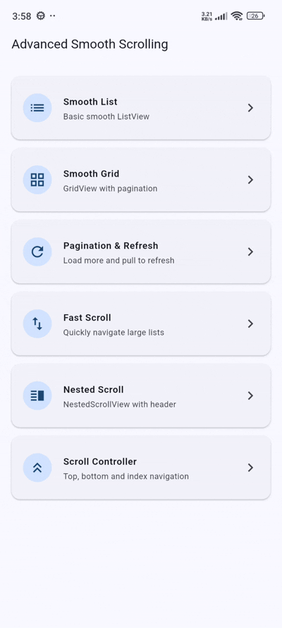

# flutter_advanced_smooth_scrolling

[](https://flutter.dev)
[](https://opensource.org/licenses/MIT)
[](#)

**flutter_advanced_smooth_scrolling** is a premium, high-performance, and highly customizable smooth scrolling solution for Flutter. It provides physics-optimized list and grid views, effortless infinite scroll pagination, pull-to-refresh, fast-scrollbar navigation, nested scroll headers, and advanced programmatic scroll control.

---

## 📷 Preview

<p align="center">
  
</p>

*A premium smooth scrolling library featuring physics-driven list/grid rendering, real-time pagination, fast scroll drag navigation, nested scroll headers, and programmatic index jump capabilities.*

---

## ✨ Features

- **⚡ Physics-Optimized Smooth Scrolling**
  - Built with optimized bouncing scroll physics for silky-smooth touch, trackpad, and mouse-wheel scrolling across mobile, web, and desktop platforms.
- **🔄 Built-in Pagination & Pull-to-Refresh**
  - Seamless async data fetching (`onLoadMore`, `onRefresh`) with configurable trigger thresholds, custom loading indicators, and error/empty state widgets.
- **📐 Smooth Grid & List Views**
  - Ready-to-use `AdvancedListView` and `AdvancedGridView` widgets with rich layout controls (crossAxisCount, spacing, aspect ratios, padding, and shrinkWrap).
- **🚀 Interactive Fast Scrollbar**
  - Enable interactive, visible scrollbars via `enableFastScroll: true` to quickly navigate large lists and grids.
- **📌 Advanced Nested Scroll View**
  - Easily wrap flexible header slivers (such as `SliverAppBar`) and body scroll views with `AdvancedNestedScrollView`.
- **🎮 Programmatic Scroll Controller**
  - Convenient `AdvancedScrollController` API providing instant or smooth animated actions: `scrollToTop()`, `scrollToBottom()`, and `scrollToIndex()`.

---

## 📦 Installation

To use this library in your Flutter project, add it to your `pubspec.yaml` dependencies:

```yaml
dependencies:
  flutter:
    sdk: flutter
  # From pub.dev
  flutter_advanced_smooth_scrolling: ^0.0.1
```

Or reference it directly from a Git repository:

```yaml
dependencies:
  flutter_advanced_smooth_scrolling:
    git:
      url: https://github.com/your_username/flutter_advanced_smooth_scrolling.git
      ref: main
```

---

## 🚀 Usage

Import the package in your Dart code:

```dart
import 'package:flutter_advanced_smooth_scrolling/flutter_advanced_smooth_scrolling.dart';
```

### 1. Basic Smooth ListView
Create a smooth scrolling list view with custom physics and item building.

```dart
AdvancedListView(
  itemCount: 100,
  padding: const EdgeInsets.all(12),
  itemBuilder: (context, index) {
    return ListTile(
      leading: CircleAvatar(child: Text('$index')),
      title: Text('Item $index'),
      subtitle: const Text('Smooth scrolling list item'),
    );
  },
)
```

### 2. Smooth GridView
Easily build a responsive smooth grid with spacing and custom aspect ratio.

```dart
AdvancedGridView(
  itemCount: 50,
  crossAxisCount: 2,
  crossAxisSpacing: 12,
  mainAxisSpacing: 12,
  childAspectRatio: 1.0,
  padding: const EdgeInsets.all(12),
  itemBuilder: (context, index) {
    return Card(
      elevation: 2,
      child: Center(
        child: Text('Card $index'),
      ),
    );
  },
)
```

### 3. Pagination & Pull-to-Refresh
Handle infinite scrolling and pull-to-refresh out of the box.

```dart
AdvancedListView(
  itemCount: items.length,
  isLoading: isLoading,
  isLoadingMore: isLoadingMore,
  hasMore: hasMore,
  onRefresh: _handleRefresh,
  onLoadMore: _handleLoadMore,
  paginationThreshold: 300,
  itemBuilder: (context, index) {
    return ListTile(
      title: Text('Item ${items[index]}'),
    );
  },
)
```

### 4. Interactive Fast Scroll Navigation
Enable fast dragging on the scrollbar for rapid list navigation across large datasets.

```dart
AdvancedListView(
  itemCount: 500,
  enableFastScroll: true,
  itemBuilder: (context, index) {
    return ListTile(
      title: Text('Large List Item $index'),
    );
  },
)
```

### 5. Programmatic Scroll Controller
Control scroll position programmatically using `AdvancedScrollController`.

```dart
final controller = AdvancedScrollController();

// Scroll to specific index
controller.scrollToIndex(50, itemExtent: 60);

// Jump or animate to top/bottom
controller.scrollToTop();
controller.scrollToBottom();

// Attach to AdvancedListView
AdvancedListView(
  controller: controller,
  itemCount: 200,
  itemBuilder: (context, index) => ListTile(title: Text('Item $index')),
);
```

---

## 🛠️ API Reference

### `AdvancedListView` properties:

| Property | Type | Default | Description |
| :--- | :--- | :--- | :--- |
| `itemCount` | `int` | **Required** | Total number of items in the list. |
| `itemBuilder` | `IndexedWidgetBuilder` | **Required** | Widget builder function for list items. |
| `controller` | `AdvancedScrollController?` | `null` | Controller for programmatic scroll operations. |
| `onRefresh` | `Future<void> Function()?` | `null` | Callback triggered during pull-to-refresh. |
| `onLoadMore` | `Future<void> Function()?` | `null` | Async callback triggered when scrolling near the bottom. |
| `hasMore` | `bool` | `false` | Whether more items are available to fetch via pagination. |
| `isLoading` | `bool` | `false` | Shows initial loading widget when list is empty. |
| `isLoadingMore` | `bool` | `false` | Shows bottom loading indicator during pagination. |
| `hasError` | `bool` | `false` | Displays error widget when data fetching fails. |
| `onRetry` | `VoidCallback?` | `null` | Action invoked when tapping the default retry button. |
| `emptyWidget` | `Widget?` | `null` | Custom widget displayed when `itemCount` is 0. |
| `errorWidget` | `Widget?` | `null` | Custom widget displayed when `hasError` is true. |
| `loadingWidget` | `Widget?` | `null` | Custom widget displayed during initial load. |
| `loadingMoreWidget` | `Widget?` | `null` | Custom widget displayed at list bottom during pagination. |
| `physics` | `ScrollPhysics?` | `BouncingScrollPhysics()` | Custom scroll physics applied to the list view. |
| `padding` | `EdgeInsetsGeometry?` | `null` | Inner padding surrounding the scroll content. |
| `paginationThreshold` | `double` | `300.0` | Remaining scroll pixel distance before invoking `onLoadMore`. |
| `enableFastScroll` | `bool` | `false` | Wraps list in an interactive scrollbar. |
| `shrinkWrap` | `bool` | `false` | Whether the scroll view should shrink-wrap its contents. |
| `reverse` | `bool` | `false` | Reverses the scroll direction of the list view. |

### `AdvancedGridView` properties:

| Property | Type | Default | Description |
| :--- | :--- | :--- | :--- |
| `itemCount` | `int` | **Required** | Total number of grid items. |
| `itemBuilder` | `IndexedWidgetBuilder` | **Required** | Widget builder function for grid items. |
| `crossAxisCount` | `int` | `2` | Number of columns in the grid layout. |
| `crossAxisSpacing` | `double` | `8.0` | Horizontal spacing between grid columns. |
| `mainAxisSpacing` | `double` | `8.0` | Vertical spacing between grid rows. |
| `childAspectRatio` | `double` | `1.0` | Ratio of cross-axis width to main-axis height for items. |
| `controller` | `AdvancedScrollController?` | `null` | Controller for programmatic scroll operations. |
| `onRefresh` | `Future<void> Function()?` | `null` | Pull-to-refresh callback. |
| `onLoadMore` | `Future<void> Function()?` | `null` | Infinite pagination callback. |
| `hasMore` | `bool` | `false` | Controls pagination availability. |
| `enableFastScroll` | `bool` | `false` | Enables interactive scrollbar overlay. |

### `AdvancedScrollController` methods:

| Method | Returns | Description |
| :--- | :--- | :--- |
| `scrollToTop({Duration, Curve})` | `Future<void>` | Smoothly animates scroll position to top (offset 0). |
| `scrollToBottom({Duration, Curve})` | `Future<void>` | Smoothly animates scroll position to maximum bottom. |
| `scrollToIndex(int index, {double itemExtent, Duration, Curve})` | `Future<void>` | Smoothly animates scroll position to target item index. |
| `jumpTo(double offset)` | `void` | Jumps instantly to specified scroll offset. |
| `animateTo(double offset, {Duration, Curve})` | `Future<void>` | Animates scroll position to specified offset. |

---

## 📄 License

```lic
MIT License

Copyright (c) 2026 Excelsior Technologies

Permission is hereby granted, free of charge, to any person obtaining a copy
of this software and associated documentation files (the "Software"), to deal
in the Software without restriction, including without limitation the rights
to use, copy, modify, merge, publish, distribute, sublicense, and/or sell
copies of the Software, and to permit persons to whom the Software is
furnished to do so, subject to the following conditions:

The above copyright notice and this permission notice shall be included in all
copies or substantial portions of the Software.

THE SOFTWARE IS PROVIDED "AS IS", WITHOUT WARRANTY OF ANY KIND, EXPRESS OR
IMPLIED, INCLUDING BUT NOT LIMITED TO THE WARRANTIES OF MERCHANTABILITY,
FITNESS FOR A PARTICULAR PURPOSE AND NONINFRINGEMENT. IN NO EVENT SHALL THE
AUTHORS OR COPYRIGHT HOLDERS BE LIABLE FOR ANY CLAIM, DAMAGES OR OTHER
LIABILITY, WHETHER IN AN ACTION OF CONTRACT, TORT OR OTHERWISE, ARISING FROM,
OUT OF OR IN CONNECTION WITH THE SOFTWARE OR THE USE OR OTHER DEALINGS IN THE
SOFTWARE.
```
